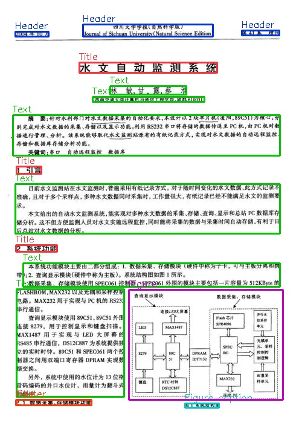

### 利用java-yolov8实现版面检测
利用java加载yolov8模型，进行推理，以及前后处理均以java实现。

java-yolov8 is used to detect the layout of Chinese document images

#### 模型下载、推理
本项目根据开源中文版面数据[CDLA](https://github.com/buptlihang/CDLA)  ，利用yolov8进行训练

CDLA是一个中文文档版面分析数据集，面向中文文献类（论文）场景。包含以下10个label：

|正文|标题|图片|图片标题|表格|表格标题|页眉|页脚|注释|公式|
|---|---|---|---|---|---|---|---|---|---|
|Text|Title|Figure|Figure caption|Table|Table caption|Header|Footer|Reference|Equation|

模型下载：

链接：https://pan.baidu.com/s/1cqMLPKcIOatXmCxmR3QnVQ 

提取码：g39u

推理：src/main/java/sy
```
public static void main(String...args) {
        String modelPath = MainTest.class.getClassLoader().getResource(PropertiesReader.get("model_path")).getPath().replaceFirst("/", "");
        String labelPath = MainTest.class.getClassLoader().getResource(PropertiesReader.get("table_det_labels_path")).getPath().replaceFirst("/", "");
        String imgPath = "D:\\project\\idea_workspace\\layout_analysis4j\\img\\test.webp";

        try {
            ModelDet modelDet = new ModelDet(modelPath, labelPath);
            Mat img = Imgcodecs.imread(imgPath);
            if (img.dataAddr() == 0) {
                System.out.println("Could not open image: " + imgPath);
                System.exit(1);
            }
            // run detection
            try {
                List<Detection> detectionList = modelDet.detectObjects(img);

                ImageUtil.drawPredictions(img, detectionList);
                System.out.println(JSON.toJSONString(detectionList));
                Imgcodecs.imwrite("D:\\project\\idea_workspace\\layout_analysis4j\\img\\prediction.jpg", img);
            } catch (OrtException ortException) {
                ortException.printStackTrace();
            }

        } catch (OrtException e) {
            e.printStackTrace();
        }
    }
```

<br/>
<p align="center">
  <a>
    
  </a>
</p>
<br/>


#### contact

1、github：https://github.com/jiangnanboy

2、博客：https://www.cnblogs.com/little-horse/

3、邮件:2229029156@qq.com

#### reference
https://github.com/jiangnanboy/layout_analysis

https://github.com/ultralytics/ultralytics

https://github.com/buptlihang/CDLA

